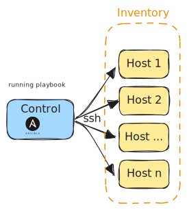

# What does Ansible solve

[Ansible](https://ansible.com) is self described as a "radically simple" automation platform to make your applications and systems easier to deploy and maintain.

And in my opinion its a tool that can utilise to automate pretty much anything, but while it can do alot its not the best tool for all jobs.

> ["Ansible is my golden hammer"](https://www.youtube.com/watch?v=TVq88JeJbw4) /hyp \
> -- <cite>Jeff Geerling</cite>[^1]

It sees usage as:
* Configuration management
* Application deployment
* System (& cloud) provisioning
* Many more

Ansible is agentless. This meaning only the *control system* [^2] the needs ansible with a means to access the other hosts defined in your inventory, which is usally via ssh.

Ansible lets you manage multiple "hosts" at the same time from the control system. This is done by defining the hosts in an inventory file, which can be a simple text file and going futher some variable files used to specify the configuration of the hosts and applications deloyed on them.

[^1]: [Jeff Geerling](https://www.jeffgeerling.com/) is a well known author and speaker in the Ansible community. He has written a number of books on Ansible and has a [YouTube channel](https://www.youtube.com/c/JeffGeerling) where he shares his knowledge. Additionally he created and maintains some of the most popular Ansible roles on his [GitHub](https://github.com/geerlingguy?tab=repositories&q=ansible-role&sort=stargazers).

[^2]: The control system is the system that is running ansible, generally this is your system but you could have it installed on the system to manage itself or another system on the network to manage the others.
